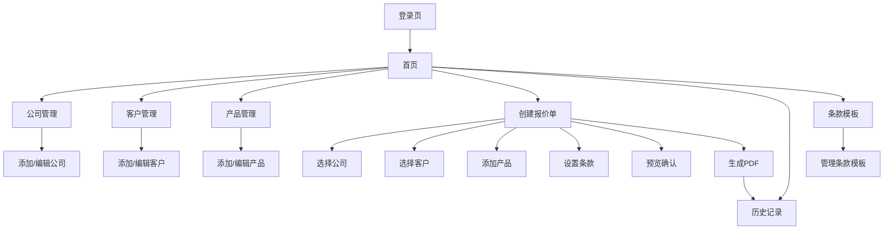

## 1. 产品概述

报价与付款发票生成系统是一个专业的企业级报价管理工具，旨在帮助公司快速创建、管理和生成专业的报价单及付款发票。系统支持多公司身份管理、产品库维护、客户信息管理，并提供灵活的PDF生成功能，满足国际贸易和本地业务的需求。

该系统主要解决企业在报价过程中的效率问题，减少人工错误，提升专业形象，适用于进出口贸易公司、制造企业、服务提供商等需要频繁制作报价单的企业用户。

## 2. 核心功能

### 2.1 用户角色

| 角色   | 注册方式    | 核心权限                |
| ---- | ------- | ------------------- |
| 管理员  | 系统初始化创建 | 管理所有公司信息、产品库、用户账户   |
| 业务员  | 管理员创建账户 | 创建报价单、管理客户信息、查看历史记录 |
| 访客用户 | 无需注册    | 查看生成的报价单（通过分享链接）    |

### 2.2 功能模块

系统包含以下核心功能模块：

1. **公司身份管理**：支持管理最多三套公司信息，包括公司基本资料、银行信息、Logo等
2. **客户信息管理**：维护买方客户的基本信息和联系方式
3. **产品库管理**：建立产品数据库，包含产品信息和建议价格体系
4. **报价单管理**：创建、编辑、管理报价单，支持多币种和多种付款方式
5. **PDF生成**：生成专业的报价单和付款发票PDF文档
6. **历史记录**：存储和检索历史报价记录
7. **条款模板**：管理常用的交易条款和条件模板

### 2.3 页面详情

| 页面名称  | 模块名称 | 功能描述                             |
| ----- | ---- | -------------------------------- |
| 登录页   | 用户认证 | 输入用户名密码登录系统，支持记住登录状态             |
| 首页    | 导航菜单 | 显示系统主要功能入口，包括快速创建报价、查看历史记录等快捷操作  |
| 公司管理  | 公司列表 | 显示已配置的公司信息卡片，支持添加、编辑、删除公司        |
| 公司管理  | 公司编辑 | 编辑公司基本信息（名称、地址、联系方式）、银行信息、上传Logo |
| 客户管理  | 客户列表 | 显示所有客户信息，支持搜索和筛选                 |
| 客户管理  | 客户编辑 | 添加新客户，编辑客户基本信息和联系方式              |
| 产品管理  | 产品列表 | 显示产品目录，支持分类管理和搜索功能               |
| 产品管理  | 产品编辑 | 添加新产品，设置产品名称、规格、单位、建议价格等信息       |
| 报价单创建 | 基本信息 | 选择公司身份、客户信息、设置报价单编号、日期、有效期       |
| 报价单创建 | 产品选择 | 从产品库中选择产品，设置数量、单价、折扣等            |
| 报价单创建 | 条款设置 | 选择付款方式、交货条款、有效期等交易条件             |
| 报价单预览 | 预览界面 | 实时预览报价单内容，支持编辑和确认                |
| PDF生成 | 版式选择 | 选择PDF模板和版式风格                     |
| 历史记录  | 记录列表 | 显示历史报价记录，支持按日期、客户、状态筛选           |
| 历史记录  | 记录详情 | 查看历史报价单详情，支持重新编辑和再次生成PDF         |
| 条款模板  | 模板管理 | 管理常用的交易条款模板，支持添加、编辑、删除           |

## 3. 核心流程

### 业务员操作流程

1. 登录系统 → 进入首页
2. 创建新报价单 → 选择公司身份 → 选择或添加客户信息
3. 添加产品项目 → 从产品库选择或手动输入 → 设置数量和价格
4. 设置交易条款 → 选择付款方式、交货条件等
5. 预览报价单 → 确认信息无误
6. 生成PDF → 选择版式 → 下载或分享
7. 报价单自动保存到历史记录

### 管理员操作流程

包含业务员所有权限，额外可以：

1. 管理公司信息配置
2. 维护产品库
3. 管理用户账户
4. 配置系统设置

## 4. 用户界面设计

### 4.1 设计风格

* **主色调**：深蓝色 (#1e40af) 作为主品牌色，配合白色背景

* **辅助色**：浅灰色 (#f3f4f6) 用于背景区域，绿色 (#10b981) 用于成功状态

* **按钮样式**：圆角矩形设计，主要操作为实心填充，次要操作为边框样式

* **字体选择**：中文使用思源黑体，英文使用Inter字体，确保跨平台一致性

* **布局风格**：左侧导航栏 + 右侧内容区域的经典管理后台布局

* **图标风格**：使用线性图标，保持简洁专业的视觉效果

### 4.2 页面设计概述

| 页面名称  | 模块名称 | UI元素                              |
| ----- | ---- | --------------------------------- |
| 首页    | 导航菜单 | 左侧深色导航栏，包含logo和主要功能菜单，顶部显示用户信息    |
| 公司管理  | 公司卡片 | 网格布局展示公司卡片，每个卡片显示公司Logo、名称、主要联系信息 |
| 报价单创建 | 步骤导航 | 顶部显示创建进度条，分步骤引导用户完成报价单创建          |
| 产品选择  | 产品列表 | 表格形式展示产品，支持多选，实时显示价格小计            |
| PDF预览 | 预览窗口 | 右侧显示PDF预览效果，左侧提供编辑和版式选择控件         |
| 历史记录  | 记录表格 | 表格形式展示历史记录，支持排序、筛选和搜索功能           |

### 4.3 响应式设计

* **桌面端优先**：主要面向桌面端用户，充分利用屏幕空间

* **平板适配**：支持768px以上平板设备，优化触摸操作体验

* **移动端基础支持**：核心功能在移动端可访问，PDF生成等复杂操作建议在桌面端完成

* **打印优化**：生成的PDF文档支持高质量打印输出

## 5. 数据管理要求

### 5.1 数据存储需求

* **公司信息**：持久化存储多套公司完整信息，包括文本和图像数据

* **客户信息**：安全存储客户联系信息和交易历史

* **产品库**：维护完整的产品目录，支持分类和搜索

* **报价记录**：完整保存历史报价单，支持快速检索和复用

* **模板数据**：存储条款模板和PDF版式模板

### 5.2 数据安全

* 用户身份验证和权限控制

* 敏感数据的加密存储

* 定期数据备份机制

* 操作日志记录和审计

### 5.3 性能要求

* 页面加载时间不超过3秒

* PDF生成响应时间不超过5秒

* 支持同时处理多个报价单创建请求

* 数据库查询优化，

