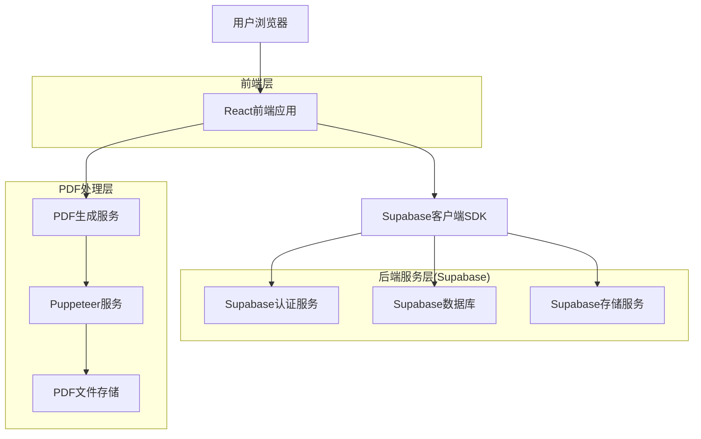
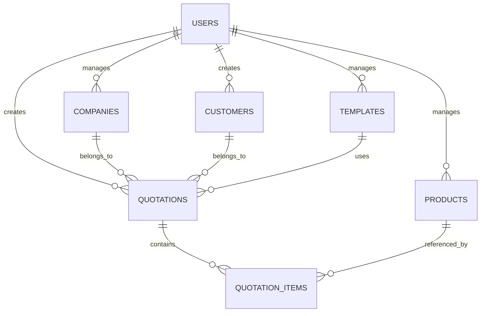
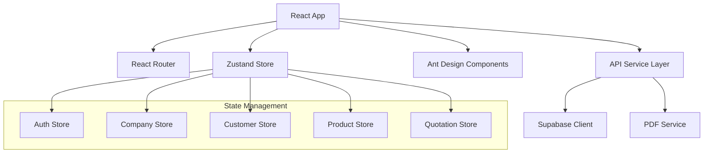
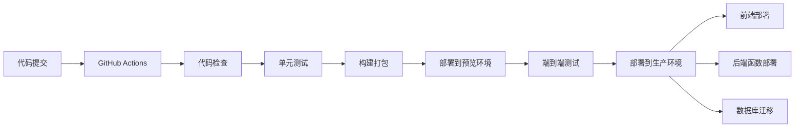

## 1. 架构设计



## 2. 技术描述

### 2.1 前端技术栈

* **框架**: React\@18 + TypeScript\@5

* **构建工具**: Vite\@5

* **状态管理**: Zustand\@4 (轻量级状态管理)

* **UI组件库**: Ant Design\@5 (企业级UI组件)

* **样式方案**: Tailwind CSS\@3 (原子化CSS)

* **路由**: React Router\@6

* **表单处理**: React Hook Form\@7 + Zod\@3 (表单验证)

* **PDF生成**: html2canvas\@1 + jspdf\@2 (客户端PDF生成)

* **图表库**: Recharts\@2 (数据可视化)

### 2.2 后端技术栈

* **后端服务**: Supabase (BaaS平台)

* **数据库**: PostgreSQL\@15 (通过Supabase提供)

* **认证**: Supabase Auth (内置认证服务)

* **文件存储**: Supabase Storage (对象存储)

* **实时功能**: Supabase Realtime (实时数据同步)

* **边缘函数**: Supabase Edge Functions (serverless函数)

### 2.3 开发工具

* **代码规范**: ESLint\@8 + Prettier\@3

* **Git钩子**: Husky\@8 + lint-staged\@15

* **包管理**: pnpm\@8 (高效的包管理器)

* **环境管理**: dotenv\@16

## 3. 路由定义

| 路由                      | 用途            | 权限要求  |
| ----------------------- | ------------- | ----- |
| /login                  | 登录页面，用户身份验证   | 匿名访问  |
| /                       | 首页，系统导航和功能入口  | 需要认证  |
| /companies              | 公司管理页面，显示公司列表 | 需要认证  |
| /companies/new          | 新建公司页面        | 管理员权限 |
| /companies/:id/edit     | 编辑公司信息页面      | 管理员权限 |
| /customers              | 客户管理页面，显示客户列表 | 需要认证  |
| /customers/new          | 新建客户页面        | 需要认证  |
| /customers/:id/edit     | 编辑客户信息页面      | 需要认证  |
| /products               | 产品管理页面，显示产品列表 | 需要认证  |
| /products/new           | 新建产品页面        | 需要认证  |
| /products/:id/edit      | 编辑产品信息页面      | 需要认证  |
| /quotations/new         | 创建报价单页面（步骤式）  | 需要认证  |
| /quotations/:id         | 报价单详情页面       | 需要认证  |
| /quotations/:id/edit    | 编辑报价单页面       | 需要认证  |
| /quotations/:id/preview | 报价单预览页面       | 需要认证  |
| /quotations/:id/pdf     | PDF生成和下载页面    | 需要认证  |
| /history                | 历史记录页面        | 需要认证  |
| /templates              | 条款模板管理页面      | 需要认证  |
| /settings               | 系统设置页面        | 管理员权限 |
| /share/:token           | 报价单分享页面（只读）   | 匿名访问  |

## 4. 数据模型

### 4.1 核心数据模型



### 4.2 数据库表结构

#### 用户表 (users)

```sql
CREATE TABLE users (
    id UUID PRIMARY KEY DEFAULT gen_random_uuid(),
    email VARCHAR(255) UNIQUE NOT NULL,
    role VARCHAR(20) DEFAULT 'sales' CHECK (role IN ('admin', 'sales')),
    name VARCHAR(100) NOT NULL,
    avatar_url TEXT,
    is_active BOOLEAN DEFAULT true,
    created_at TIMESTAMP WITH TIME ZONE DEFAULT NOW(),
    updated_at TIMESTAMP WITH TIME ZONE DEFAULT NOW()
);

-- 权限设置
GRANT SELECT ON users TO authenticated;
GRANT ALL ON users TO authenticated;
```

#### 公司表 (companies)

```sql
CREATE TABLE companies (
    id UUID PRIMARY KEY DEFAULT gen_random_uuid(),
    user_id UUID REFERENCES users(id) ON DELETE CASCADE,
    name VARCHAR(200) NOT NULL,
    logo_url TEXT,
    address TEXT,
    phone VARCHAR(50),
    email VARCHAR(255),
    website TEXT,
    bank_name VARCHAR(200),
    bank_account VARCHAR(100),
    swift_code VARCHAR(50),
    tax_number VARCHAR(100),
    is_default BOOLEAN DEFAULT false,
    created_at TIMESTAMP WITH TIME ZONE DEFAULT NOW(),
    updated_at TIMESTAMP WITH TIME ZONE DEFAULT NOW()
);

-- 权限设置
GRANT SELECT ON companies TO authenticated;
GRANT ALL ON companies TO authenticated;
```

#### 客户表 (customers)

```sql
CREATE TABLE customers (
    id UUID PRIMARY KEY DEFAULT gen_random_uuid(),
    user_id UUID REFERENCES users(id) ON DELETE CASCADE,
    name VARCHAR(200) NOT NULL,
    contact_person VARCHAR(100),
    email VARCHAR(255),
    phone VARCHAR(50),
    address TEXT,
    country VARCHAR(100),
    company_name VARCHAR(200),
    tax_number VARCHAR(100),
    notes TEXT,
    created_at TIMESTAMP WITH TIME ZONE DEFAULT NOW(),
    updated_at TIMESTAMP WITH TIME ZONE DEFAULT NOW()
);

-- 权限设置
GRANT SELECT ON customers TO authenticated;
GRANT ALL ON customers TO authenticated;
```

#### 产品表 (products)

```sql
CREATE TABLE products (
    id UUID PRIMARY KEY DEFAULT gen_random_uuid(),
    user_id UUID REFERENCES users(id) ON DELETE CASCADE,
    name VARCHAR(200) NOT NULL,
    description TEXT,
    category VARCHAR(100),
    unit VARCHAR(50),
    price DECIMAL(10,2),
    currency VARCHAR(3) DEFAULT 'USD',
    specifications JSONB,
    images TEXT[],
    is_active BOOLEAN DEFAULT true,
    created_at TIMESTAMP WITH TIME ZONE DEFAULT NOW(),
    updated_at TIMESTAMP WITH TIME ZONE DEFAULT NOW()
);

-- 权限设置
GRANT SELECT ON products TO authenticated;
GRANT ALL ON products TO authenticated;
```

#### 报价单表 (quotations)

```sql
CREATE TABLE quotations (
    id UUID PRIMARY KEY DEFAULT gen_random_uuid(),
    user_id UUID REFERENCES users(id) ON DELETE CASCADE,
    company_id UUID REFERENCES companies(id) ON DELETE SET NULL,
    customer_id UUID REFERENCES customers(id) ON DELETE SET NULL,
    quotation_number VARCHAR(50) UNIQUE NOT NULL,
    title VARCHAR(200),
    quotation_date DATE DEFAULT CURRENT_DATE,
    expiry_date DATE,
    currency VARCHAR(3) DEFAULT 'USD',
    payment_terms TEXT,
    delivery_terms TEXT,
    subtotal DECIMAL(12,2) DEFAULT 0,
    tax_rate DECIMAL(5,2) DEFAULT 0,
    tax_amount DECIMAL(12,2) DEFAULT 0,
    total_amount DECIMAL(12,2) DEFAULT 0,
    status VARCHAR(20) DEFAULT 'draft' CHECK (status IN ('draft', 'sent', 'accepted', 'rejected', 'expired')),
    notes TEXT,
    share_token VARCHAR(100) UNIQUE,
    pdf_url TEXT,
    created_at TIMESTAMP WITH TIME ZONE DEFAULT NOW(),
    updated_at TIMESTAMP WITH TIME ZONE DEFAULT NOW()
);

-- 权限设置
GRANT SELECT ON quotations TO authenticated;
GRANT ALL ON quotations TO authenticated;
```

#### 报价单项表 (quotation\_items)

```sql
CREATE TABLE quotation_items (
    id UUID PRIMARY KEY DEFAULT gen_random_uuid(),
    quotation_id UUID REFERENCES quotations(id) ON DELETE CASCADE,
    product_id UUID REFERENCES products(id) ON DELETE SET NULL,
    product_name VARCHAR(200) NOT NULL,
    description TEXT,
    quantity INTEGER NOT NULL CHECK (quantity > 0),
    unit VARCHAR(50),
    unit_price DECIMAL(10,2) NOT NULL,
    discount_rate DECIMAL(5,2) DEFAULT 0,
    discount_amount DECIMAL(10,2) DEFAULT 0,
    total_price DECIMAL(12,2) NOT NULL,
    sort_order INTEGER DEFAULT 0,
    created_at TIMESTAMP WITH TIME ZONE DEFAULT NOW()
);

-- 权限设置
GRANT SELECT ON quotation_items TO authenticated;
GRANT ALL ON quotation_items TO authenticated;
```

#### 条款模板表 (templates)

```sql
CREATE TABLE templates (
    id UUID PRIMARY KEY DEFAULT gen_random_uuid(),
    user_id UUID REFERENCES users(id) ON DELETE CASCADE,
    name VARCHAR(100) NOT NULL,
    type VARCHAR(50) CHECK (type IN ('payment_terms', 'delivery_terms', 'warranty_terms', 'other')),
    content TEXT NOT NULL,
    is_default BOOLEAN DEFAULT false,
    created_at TIMESTAMP WITH TIME ZONE DEFAULT NOW(),
    updated_at TIMESTAMP WITH TIME ZONE DEFAULT NOW()
);

-- 权限设置
GRANT SELECT ON templates TO authenticated;
GRANT ALL ON templates TO authenticated;
```

## 5. 系统架构设计

### 5.1 前端架构



### 5.2 状态管理设计

* **AuthStore**: 用户认证状态、权限信息

* **CompanyStore**: 公司信息管理、当前选中公司

* **CustomerStore**: 客户列表、选中客户信息

* **ProductStore**: 产品目录、分类管理

* **QuotationStore**: 当前报价单状态、历史记录

* **UIStore**: 界面状态、加载状态、通知消息

### 5.3 API服务层

```typescript
// Supabase服务封装
class SupabaseService {
  // 用户管理
  async signIn(email: string, password: string): Promise<User>
  async signOut(): Promise<void>
  async getCurrentUser(): Promise<User>
  
  // CRUD操作
  async create(table: string, data: any): Promise<any>
  async read(table: string, filters?: any): Promise<any[]>
  async update(table: string, id: string, data: any): Promise<any>
  async delete(table: string, id: string): Promise<void>
  
  // 文件上传
  async uploadFile(bucket: string, path: string, file: File): Promise<string>
  async getFileUrl(bucket: string, path: string): Promise<string>
}

// PDF生成服务
class PDFService {
  async generateQuotationPDF(quotationId: string): Promise<Blob>
  async generateInvoicePDF(invoiceId: string): Promise<Blob>
  async getPDFPreview(quotationData: any): Promise<string>
}
```

## 6. 性能优化策略

### 6.1 前端性能优化

* **代码分割**: 按路由和组件进行代码分割

* **懒加载**: 图片和组件懒加载

* **缓存策略**: 使用React Query进行数据缓存

* **虚拟滚动**: 大数据列表使用虚拟滚动

* **图片优化**: WebP格式、响应式图片

### 6.2 PDF生成优化

* **服务端生成**: 使用Puppeteer在服务端生成PDF

* **缓存机制**: 生成的PDF文件缓存24小时

* **异步处理**: 大文件生成使用异步队列

* **压缩优化**: PDF文件压缩优化

### 6.3 数据库优化

* **索引优化**: 为常用查询字段建立索引

* **分页查询**: 大数据集使用分页加载

* **数据归档**: 历史数据定期归档

* **连接池**: 使用数据库连接池

## 7. 安全设计

### 7.1 认证安全

* **JWT令牌**: 使用JWT进行身份验证

* **令牌刷新**: 自动刷新访问令牌

* **权限控制**: 基于角色的访问控制(RBAC)

* **会话管理**: 安全的会话管理

### 7.2 数据安全

* **数据加密**: 敏感数据加密存储

* **传输加密**: HTTPS加密传输

* **SQL注入**: 使用参数化查询

* **XSS防护**: 输入验证和输出编码

### 7.3 文件安全

* **文件类型检查**: 严格的文件类型验证

* **文件大小限制**: 限制上传文件大小

* **病毒扫描**: 上传文件病毒扫描

* **访问控制**: 文件访问权限控制

## 8. 部署架构

### 8.1 开发环境

```yaml
# docker-compose.dev.yml
version: '3.8'
services:
  frontend:
    build: ./frontend
    ports:
      - "3000:3000"
    environment:
      - NODE_ENV=development
      - VITE_SUPABASE_URL=${SUPABASE_URL}
      - VITE_SUPABASE_ANON_KEY=${SUPABASE_ANON_KEY}
    volumes:
      - ./frontend:/app
      - /app/node_modules
  
  pdf-service:
    build: ./pdf-service
    ports:
      - "8080:8080"
    environment:
      - NODE_ENV=development
```

### 8.2 生产环境

* **前端部署**: Vercel/Netlify (静态网站托管)

* **后端服务**: Supabase (托管服务)

* **PDF服务**: AWS Lambda (Serverless)

* **文件存储**: Supabase Storage/AWS S3

* **CDN**: CloudFlare (全球加速)

### 8.3 CI/CD流程



## 9. 扩展性设计

### 9.1 多语言支持

* **i18n框架**: react-i18next

* **语言文件**: JSON格式语言包

* **动态加载**: 按需加载语言文件

* **RTL支持**: 支持从右到左的语言

### 9.2 插件化架构

* **插件系统**: 支持第三方插件扩展

* **钩子机制**: 提供生命周期钩子

* **组件扩展**: 支持自定义组件

* **主题系统**: 支持自定义主题

### 9.3 第三方集成

* **API接口**: RESTful API设计

* **Webhook**: 支持事件通知

* **OAuth**: 支持第三方登录

* **文件导入**: 支持Excel/CSV导入

## 10. 监控和日志

### 10.1 应用监控

* **性能监控**: Web Vitals指标收集

* **错误监控**: Sentry错误追踪

* **用户行为**: 用户行为分析

* **业务指标**: 关键业务指标监控

### 10.2 日志管理

* **前端日志**: 客户端日志收集

* **服务端日志**: Supabase日志查看

* **审计日志**: 重要操作审计记录

* **日志分析**: 日志分析和告警

## 11. 备份和恢复

### 11.1 数据备份

* **自动备份**: 数据库每日自动备份

* **文件备份**: 文件存储定期备份

* **备份验证**: 定期验证备份完整性

* **多地存储**: 备份数据多地存储

### 11.2 灾难恢复

* **恢复流程**: 详细的恢复操作文档

* **恢复测试**: 定期进行恢复演练

* **RTO/RPO**: 明确的恢复时间目标

* **应急预案**: 完整的应急响应预案

